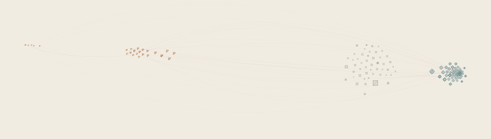

# Merge Conflict



A generative artwork built from a real, contentious GitHub thread... [w3c/csswg-drafts issue #9041](https://github.com/w3c/csswg-drafts/issues/9041)... turning 132 real comments into a force-directed graph of custom glyphs, where every visual channel maps back to a real, checked signal in the data.

## Signal to Visual Channel

| Real Signal | Visual Channel |
|---|---|
| Camp (own-display-type / grid-extension / unclassified) | Glyph shape family — diamond / L-tromino / square |
| Total reaction engagement | Glyph size |
| Contested-ness (real +1/-1 mix) | Sparse diagonal hatch texture |
| Comment body length | Stroke weight |
| Camp relationship of an edge's endpoints | Edge color — same-camp / cross-camp / touches-unclassified |

## Architecture

```
GitHub REST API (w3c/csswg-drafts issue #9041, 132 real comments)
        |
Sentiment + camp classification (spot-checked by hand)
        |
Real reply-tree edges (quote-blocks + @mentions only, no fuzzy matching)
        |
Force-directed layout, 50 seeded runs
        |
Frozen scoring rule: camp_separation x cross_tension
        |
Highest-scoring layout rendered as custom glyphs
```

## Tech Stack

Python, GitHub REST API, force-directed simulation, custom SVG rendering, Claude Code (MCP)

## Files

- `scripts/pull_comments.py` — pulls raw comment data from the GitHub REST API
- `scripts/sentiment.py` — VADER sentiment scoring per comment
- `scripts/camp.py` — rule-based camp classification (own-display-type / grid-extension / unclassified)
- `scripts/edges.py` — extracts real reply-tree edges from quote-blocks and @mentions
- `scripts/build_processed.py` — assembles the processed per-comment dataset
- `scripts/build_graph.py` — builds the node/edge graph from processed data
- `scripts/layout.py` — runs 50 seeded force-directed layout candidates and scores them
- `scripts/render.py` — renders the highest-scoring layout as custom SVG glyphs
- `scripts/upload_artwork.py` — uploads the final artwork
- `data/raw/` — raw pulled comment data (not committed)
- `data/processed/` — processed, classified comment data
- `output/` — rendered artwork (`merge_conflict_v1.svg` / `.png`) and profile assets
- `VISUAL_LANGUAGE_SIGNALS.md` — frozen signal-to-visual-channel mapping decision, with reliability grading per signal
- `SPOT_CHECK.md` — manual spot-check of the automated sentiment and camp classification against actual comment text
- `LAYOUT_CRITERION.md` — the frozen layout scoring rule and the 50-candidate seed selection process
